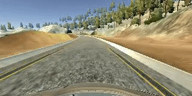

# **Behavioral Cloning** 

**Behavioral Cloning Project**

The goals / steps of this project are the following:
* Use the simulator to collect data of good driving behavior
* Build, a convolution neural network in Keras that predicts steering angles from images
* Train and validate the model with a training and validation set
* Test that the model successfully drives around track one without leaving the road
* Summarize the results with a written report

#### 1. Submission includes all required files and can be used to run the simulator in autonomous mode

My project includes the following files:
* main.py containing the script to create and train the model
* drive.py for driving the car in autonomous mode
* model.h5 containing a trained convolution neural network 
* writeup_report.md or writeup_report.pdf summarizing the results

#### 2. Submission includes functional code
Using the Udacity provided simulator and my drive.py file, the car can be driven autonomously around the track by executing 
```
python scripts/drive.py model.h5
```
For training the network
```
python main.py
```
#### 3. Submission code is usable and readable

The main.py file contains the code for training and saving the convolution neural network. The file shows the pipeline I used for training and validating the model.

### Model Architecture and Training Strategy

| Layer (type) |  Output Shape  | Param  | 
| ------------- |:-------------:| -----:|
|lambda_1 (Lambda)  | (None, 160, 320, 3)    | 0 |        
|cropping2d_1 (Cropping2D)| (None, 65, 320, 3)| 0|         
|conv2d_1 (Conv2D) |    (None, 61, 316, 6) | 456|       
|max_pooling2d_1 (MaxPooling2D)| (None, 30, 158, 6)|  0 |        
|conv2d_2 (Conv2D)|  (None, 26, 154, 6)|    906|       
|max_pooling2d_2 (MaxPooling2D)| (None, 13, 77, 6)|  0|         
|flatten_1 (Flatten) |  (None, 6006) |    0  |       
|dense_1 (Dense) |        (None, 120)   |      720840    |
|dense_2 (Dense) |        (None, 84)    |      10164     |
|dense_3 (Dense) |        (None, 1)     |          85   |     

#### 1. An appropriate model architecture has been employed

My model consists of a convolution neural network with 5x5 filter sizes (main.py lines 18-24) 

The model includes RELU layers to introduce nonlinearity (code line 8, 10), and the data is normalized in the model using a Keras lambda layer (code line 6) and then cropped (code line 7) so that extra noise (trees sky are not considered). 

Final Response:


#### 2. Attempts to reduce overfitting in the model

Initially when trained with Lenet the data was not not sufficient and overfits, so extra data is created using data augmentation by using left and right cameras

The model was trained and validated on different data sets to ensure that the model was not overfitting by using validation split (code line 20). The model was tested by running it through the simulator and ensuring that the vehicle could stay on the track.

Overfitted response:


#### 3. Model parameter tuning

The model used an adam optimizer, so the learning rate was not tuned manually (model.py line 19).

#### 4. Appropriate training data

Training data was chosen to keep the vehicle driving on the road. I used a combination of center lane driving, recovering from the left and right sides of the road.

Data is augmented as shown in the lecture using left, right cameras and getting more data. Which made the model to perform robust.

### Model Architecture and Training Strategy

#### 1. Solution Design Approach

The overall strategy for deriving a model architecture was to experiment and improvise,

My first step was to start with simple single layer fully connected neural network, and here is the response


It didn't work well, then tried the Lenet architecture, 



but the response was not good, then I cropped the images to get only road and remove noise (trees and sky), and it performed better


 
Then I observed the output is biased towards left because as mentioned in the lecture there was left data more than the right.
In order to gauge how well the model was working, I split my image and steering angle data into a training and validation set. I found that my first model had a low mean squared error on the training set but a high mean squared error on the validation set. This implied that the model was overfitting. 

To combat the overfitting, I augmented the data using left and right cameras created more data and the generalization was so good, Here is the response


At the end of the process, the vehicle is able to drive autonomously around the track without leaving the road. HD video is here:

<a href="http://www.youtube.com/watch?feature=player_embedded&v=rpTw07datrc
" target="_blank"></a>

#### 2. Final Model Architecture

use a convolution neural network model similar to the Lenet I thought this model might be appropriate because in transfer learning lecture, we have noticed for different dataset we have to train it from scractch replacing the last layer according to our output (here it is steering angles)

#### 3. Creation of the Training Set & Training Process

To capture good driving behavior, I first recorded one lap on track one using center lane driving.

To get the recovery motion not to go away from the center of road, I used left and right cameras and augmented data with constant angle (0.2) to move the other side 

After the collection process, I had 8700 number of data points. I then preprocessed this data by normalizing and cropping till the road and removing the sky and trees.

I finally randomly shuffled the data set and put 20% of the data into a validation set. 

I used this training data for training the model. The validation set helped determine if the model was over or under fitting. The ideal number of epochs was 7 as evidenced by experimenting. I used an adam optimizer so that manually training the learning rate wasn't necessary.
